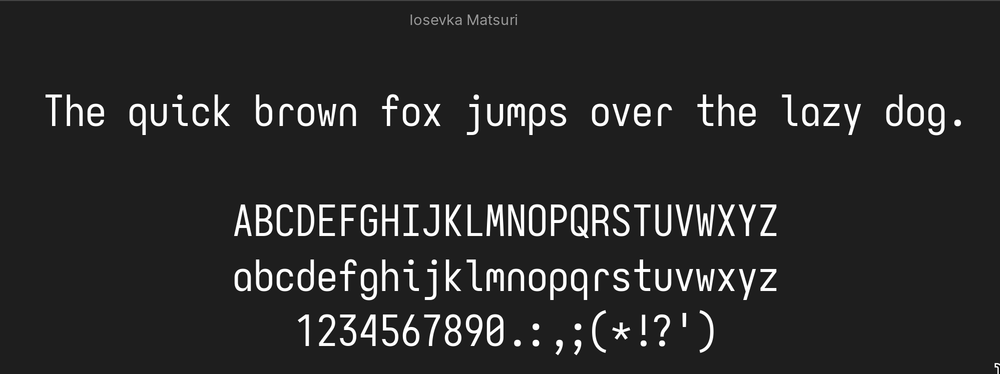
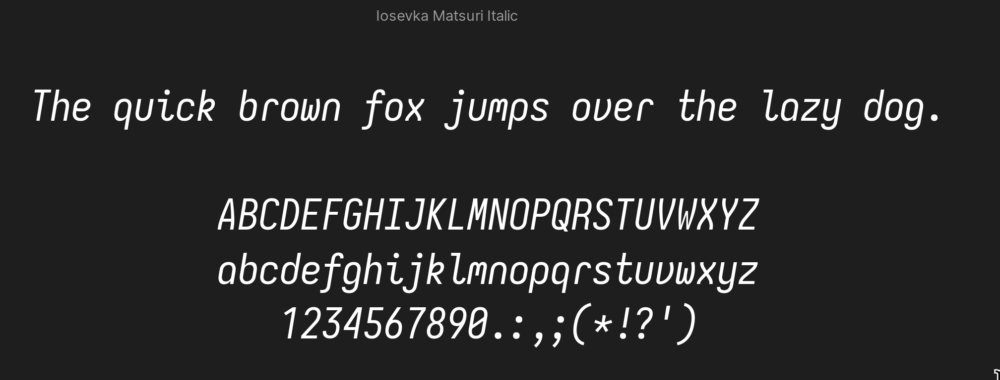

# Iosevka Matsuri 祭り

A comfortable monospace font based on Iosevka Custom Build.

## Preview

## How do I use it?

- Download the zip or clone this repository
- Font files are inside of the [src](../src/)
  - These includes TTF, WOFF(2), and CSS files.
  - In the src folder you'll find two versions of the font which are:
    - IosevkaMatsuri: Optimised for almost every application.
    - IosevkaMatsuri: Pretty much suitable mostly for terminal usage
- Install the font based on where you want to use it!
  - MacOS
    - Open the fontbook application, drag and drop the ttf files of the desired font to install
    and then restart the desired apps or if you want to be safe, just restart the system
  - Windows
    - On Windows you can install the fonts by just right clicking and installing
    them for your user or if you want to install them for every user choose the
    desired option and windows will start working on installing Iosevka Matsuri!
  - Linux
    - Take the TTF files and then drop them all in `$HOME/.local/share/fonts` for
    user only, or if you want to install them for every user, just drop them to
    `/usr/share/fonts`. Additionally, run `fc-cache -vf` in a terminal window in
    order to refresh the fonts cache.